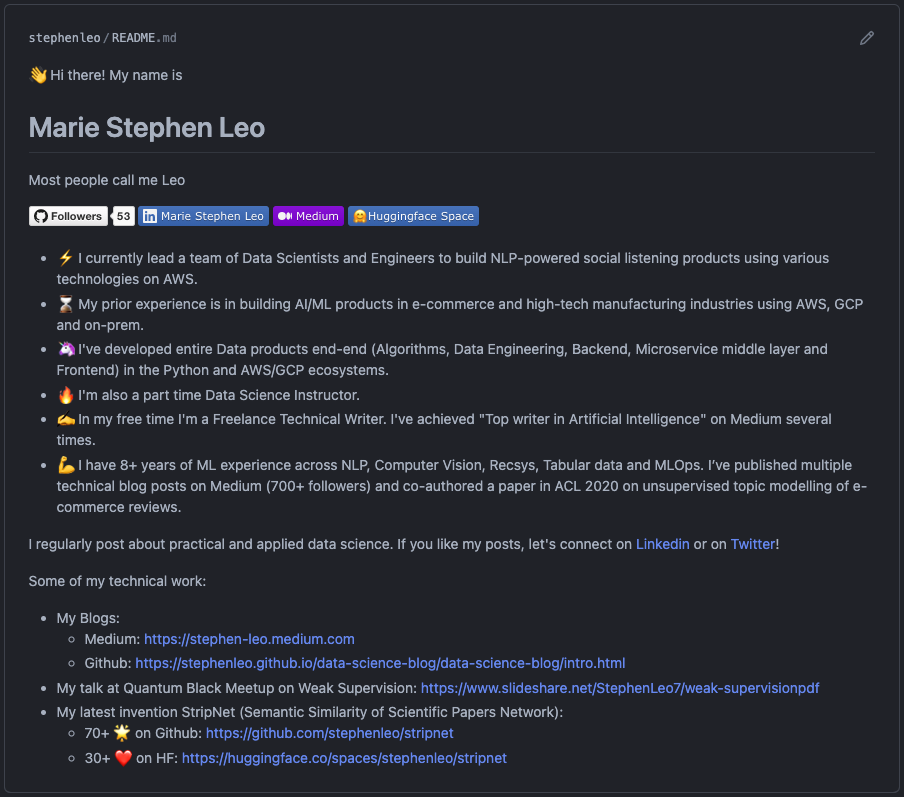

# Portfolio

## GitHub Readme

🙋 If you’re a programmer and looking for a job, chances are your hiring
manager will look at your GitHub profile during the hiring process.
Having a concise summary of your profile on GitHub helps make your
profile stand out!

💡 One way to create your GitHub stats and most used languages is to use
the excellent GitHub Readme stats library. I’ve used it to make my
GitHub README below. Feel free to fork it and update your profile!
Remember that the name of this repository should be the same as your
GitHub handle.

👍 Don’t worry too much about your stats. It may not be much, but it’s
better than nothing!

🌟 My personal GitHub Readme: <https://github.com/stephenleo/stephenleo>

🚀 Github Readme Stats Library:
<https://github.com/anuraghazra/github-readme-stats>

## Blogging

### Jupyter Book

Create beautiful, publication-quality online (and pdf) books using
Jupyter Notebooks!

-   Include markdown text, code, and code outputs.
-   Directly open each page in Binder or Google Colab to follow along.
-   Publish the book for free on GitHub pages.
-   Perfect for publishing your own technical blog or portfolio!

🌟 Github: <https://github.com/executablebooks/jupyter-book>

📖 Documentation: <https://jupyterbook.org/en/stable/intro.html>

📊 Example Jupyterbook - Data Visualization Curriculum:
<https://uwdata.github.io/visualization-curriculum/intro.html>
