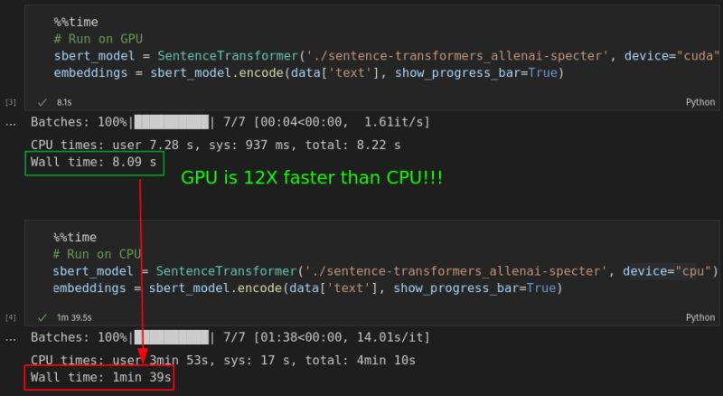

# Compute

## CPU vs GPU

If you’re new to the world of Data Science, you might’ve heard someone
mention using a “GPU.”

What is a GPU? a Graphics Processing Unit is fundamentally just another
component that goes into your computer similar to the hard disk or RAM.
They’re really good at specific tasks such as gaming and applications
which require high graphics power. However, in recent years, GPUs have
become much more valuable due to 2 reasons:

1.  Computer scientists discovered that GPUs are perfect for Deep
    Learning, a class of Machine Learning heavily used in Computer
    Vision and NLP.
2.  Bitcoin and other Cryptocurrency miners discovered that GPUs allow
    much faster mining!

Though I would love to have made a million bucks on crypto, I’m but a
humble programmer and cannot advise you on crypto mining. I can,
however, advise you on running Deep Learning models on a GPU.

Below is a very simple benchmarking running a popular NLP model called
Sentence Transformers on a CPU and a GPU. The same code can run 12X
faster on a GPU!

But note that not all ML libraries benefit from a GPU. In general, if
you’re programming using [Tensorflow](https://www.tensorflow.org/) or
[Pytorch](https://pytorch.org/), there’s a high chance you should see a
speedup using GPU. Sorry
[scikit-learn](https://scikit-learn.org/stable/) fans, as far as I know,
it doesn’t support GPU (yet!).

If you want to use a GPU with algorithms from sklearn, then check out
the fantastic [RAPIDS cuML library](https://github.com/rapidsai/cuml)
instead. It has the GPU versions of many popular algorithms that you’d
normally use sklearn for!

Finally, what if your computer doesn’t have a GPU? New GPUs have been
facing an acute shortage for some time now, and frankly, I’m fed up with
all the scalpers selling GPUs at insanely marked-up prices!

Having said that, the best ways to get started with a GPU are entirely
free, albeit with some reasonable limitations. Do check them out if you
need to use one!

1.  [Google
    Colab](https://colab.research.google.com/notebooks/gpu.ipynb)
2.  [Kaggle Kernel](https://www.kaggle.com/general/97939#1651969)
3.  [AWS Sagemaker Studio
    Lab](https://aws.amazon.com/sagemaker/studio-lab/)
4.  [Gradient Notebooks](https://gradient.run/)

