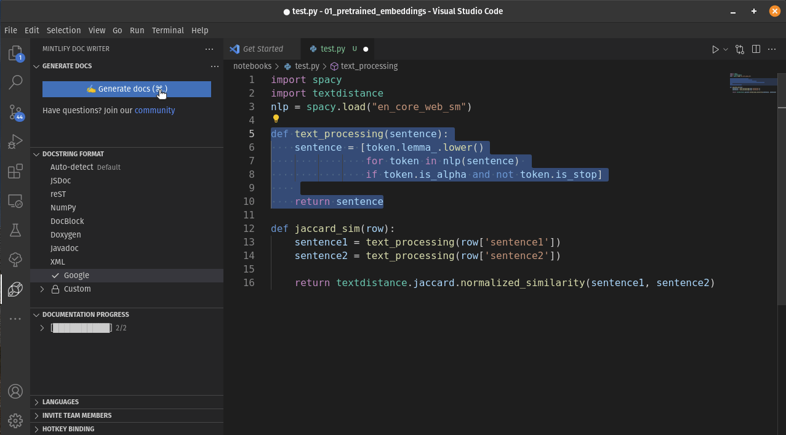

# Refactoring

## Sourcery: Automated code refactoring!

-   Real-time refactoring suggestions with one-click updates
-   Code quality feedback
-   Refactoring explanations to make you a better programmer!
-   Star the repo to get an automated refactoring PR on your most
    popular repos!
-   VSCode Extension

🌟 Github: <https://github.com/sourcery-ai/sourcery>

🔥 VSCode/ Pycharm extensions: <https://sourcery.ai/>

💯 Supported Refactorings: <https://docs.sourcery.ai/refactorings/>

<iframe id="video" width="560" height="315" src="https://sourcery.ai/static/sourcery-producthunt-3f6370038174e1e118bf13a0785f2d0f.mp4" frameborder="0" allow="autoplay; encrypted-media" allowfullscreen>
</iframe>

## Mintlify: Automated Documentation

🤔 What’s the most boring part about coding? Arguably it’s
documentation! Well, fret not! You can now generate function docstrings
automagically 🪄 with this amazing VSCode extension by
[Mintlify](https://www.linkedin.com/company/mintsearch/)!!!

🔥 And yes! It works with Jupyter in VSCode too! One more reason to
switch to VSCode for development

🌟 Github: <https://github.com/mintlify/vscode-docs>

## Jupyter Magic Commands

I have a love-hate relationship with Jupyter notebooks. One of the
things I love is magic commands! My top 3 favorite Jupyter notebook
magic commands are…

1.  `%%writefile <filename>` —&gt; Writes the contents of the entire
    cell into `<filename>` file. Super useful to move all your helper
    functions to a `utils.py`

2.  `%%time` —&gt; Measures the execution time of the entire cell and
    prints it below. Super valuable for benchmark code in different
    cells

3.  `%%bash` —&gt; Run the contents of the entire cell as a bash script.
    Super helpful in environments where you don’t have direct access to
    the terminal, such as in a Colab or Kaggle notebook

ℹ️ Jupyter magic commands documentation:
<https://ipython.readthedocs.io/en/stable/interactive/magics.html>

<iframe width="740" height="740" title="Code snippet - jupyter_magics" src="https://snappify.io/embed/07ffb1cc-efdd-40c1-9c2d-c97b7fe2b354?responsive" allow="clipboard-write" style="background:linear-gradient(337deg, #654ea3, #da98b4);position:absolute;left:0;top:0;width:100%" frameborder="0"></iframe>

## LaTeX best practices

Compilation of best practices to writing with LaTeX!

🌟 Github: <https://github.com/Wookai/paper-tips-and-tricks>
